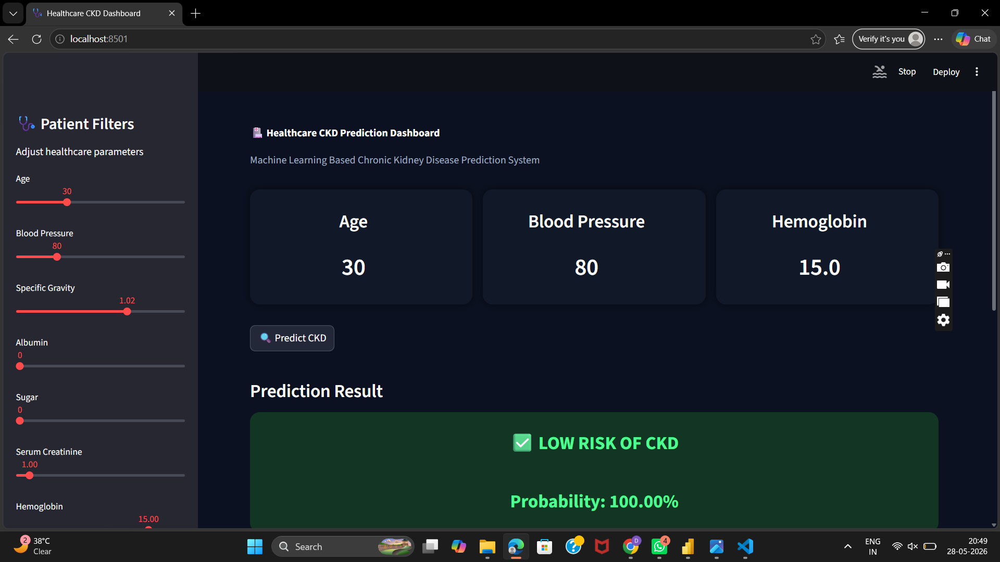
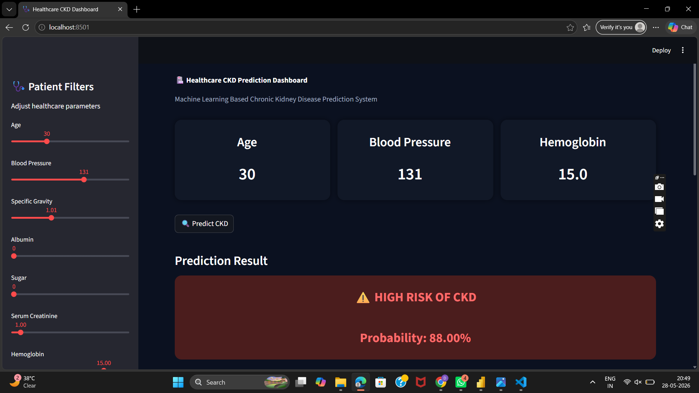
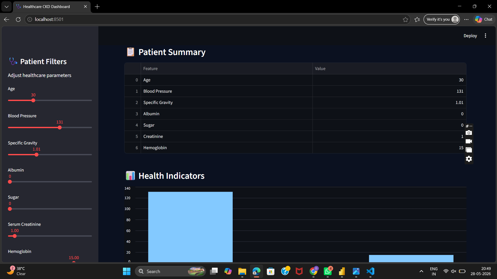

# 🏥 Healthcare CKD Prediction and EHR Analysis

A comprehensive Healthcare Analytics project focused on Chronic Kidney Disease (CKD) prediction and patient health analysis — built with Python, Power BI, and Streamlit.

🔗 **Live Demo:** https://healthcare-and-medical-analysis.streamlit.app/

---

## 📌 Project Overview

This project analyzes healthcare data to identify patterns and risk factors associated with Chronic Kidney Disease (CKD). By combining machine learning with interactive dashboards, it provides meaningful insights into patient conditions including:

- Blood Pressure & Hypertension
- Diabetes Mellitus
- Hemoglobin Levels
- Serum Creatinine
- Blood Glucose (Random)
- Appetite-based Health Indicators

---

## 🎯 Objectives

- Analyze CKD vs. Non-CKD patient data
- Identify key biomarkers and risk factors for CKD
- Visualize patient health statistics interactively
- Build a predictive model for CKD detection
- Deliver insights through Power BI and Streamlit dashboards

---

## 🛠️ Tools & Technologies

| Category          | Tools                              |
|-------------------|------------------------------------|
| Language          | Python                             |
| Data Processing   | Pandas, NumPy                      |
| Visualization     | Matplotlib, Seaborn, Power BI      |
| Machine Learning  | Scikit-learn                       |
| Web App           | Streamlit                          |
| Notebook          | Jupyter Notebook                   |

---

## 📂 Dataset Features

The dataset contains patient health records including:

- **Age** – Patient age group
- **Blood Pressure** – Measured BP levels
- **Specific Gravity** – Urine specific gravity
- **Albumin & Sugar** – Kidney function indicators
- **Red Blood Cells** – RBC count in urine
- **Blood Glucose Random** – Random glucose levels
- **Blood Urea & Serum Creatinine** – Kidney filtration markers
- **Hemoglobin** – Blood hemoglobin levels
- **Hypertension & Diabetes Mellitus** – Comorbidity flags
- **CKD Classification** – Target variable (CKD / Not CKD)

---

## 🔍 Key Analysis Performed

### 🩺 Patient Distribution Analysis
- CKD vs. Non-CKD patient breakdown
- Age group distribution
- Gender-wise health comparison

### 📉 Biomarker Analysis
- Hemoglobin and Serum Creatinine trends
- Blood Glucose and Blood Urea patterns
- Correlation between biomarkers and CKD

### ❤️ Comorbidity Analysis
- Hypertension impact on CKD
- Diabetes Mellitus and CKD relationship
- Appetite-based CKD insights

---

## 📊 Dashboard Features

### Power BI Dashboard
- KPIs: Total Patients, CKD Count, Non-CKD Count
- Age vs. Blood Pressure analysis
- Hypertension & Diabetes distribution charts
- Biomarker average comparisons
- Interactive filters and slicers

### Streamlit Dashboard
- Real-time CKD prediction interface
- Dynamic patient health filtering
- Interactive biomarker visualizations
- Dark theme healthcare UI

---

## 📸 Dashboard Preview

### Streamlit Dashboard

-Getting Started section with install and run commands
Workflow diagram showing the full pipeline
Future Improvements checklist
To add it to GitHub, just copy the content and paste it into your README.md file in the repository. Let me know if you'd like any changes!

Healthcare readme
Document · MD 
Give the in chat so that i csn copy paste

17:58
Here's the full markdown — copy and paste it into your GitHub README:

markdown
# 🏥 Healthcare CKD Prediction and EHR Analysis

A comprehensive Healthcare Analytics project focused on Chronic Kidney Disease (CKD) prediction and patient health analysis — built with Python, Power BI, and Streamlit.

🔗 **Live Demo:** [Streamlit App](https://healthcare-and-medical-analysis.streamlit.app/)

---

## 📌 Project Overview

This project analyzes healthcare data to identify patterns and risk factors associated with Chronic Kidney Disease (CKD). By combining machine learning with interactive dashboards, it provides meaningful insights into patient conditions including:

- Blood Pressure & Hypertension
- Diabetes Mellitus
- Hemoglobin Levels
- Serum Creatinine
- Blood Glucose (Random)
- Appetite-based Health Indicators

---

## 🎯 Objectives

- Analyze CKD vs. Non-CKD patient data
- Identify key biomarkers and risk factors for CKD
- Visualize patient health statistics interactively
- Build a predictive model for CKD detection
- Deliver insights through Power BI and Streamlit dashboards

---

## 🛠️ Tools & Technologies

| Category          | Tools                              |
|-------------------|------------------------------------|
| Language          | Python                             |
| Data Processing   | Pandas, NumPy                      |
| Visualization     | Matplotlib, Seaborn, Power BI      |
| Machine Learning  | Scikit-learn                       |
| Web App           | Streamlit                          |
| Notebook          | Jupyter Notebook                   |

---

## 📂 Dataset Features

The dataset contains patient health records including:

- **Age** – Patient age group
- **Blood Pressure** – Measured BP levels
- **Specific Gravity** – Urine specific gravity
- **Albumin & Sugar** – Kidney function indicators
- **Red Blood Cells** – RBC count in urine
- **Blood Glucose Random** – Random glucose levels
- **Blood Urea & Serum Creatinine** – Kidney filtration markers
- **Hemoglobin** – Blood hemoglobin levels
- **Hypertension & Diabetes Mellitus** – Comorbidity flags
- **CKD Classification** – Target variable (CKD / Not CKD)

---

## 🔍 Key Analysis Performed

### 🩺 Patient Distribution Analysis
- CKD vs. Non-CKD patient breakdown
- Age group distribution
- Gender-wise health comparison

### 📉 Biomarker Analysis
- Hemoglobin and Serum Creatinine trends
- Blood Glucose and Blood Urea patterns
- Correlation between biomarkers and CKD

### ❤️ Comorbidity Analysis
- Hypertension impact on CKD
- Diabetes Mellitus and CKD relationship
- Appetite-based CKD insights

---

## 📊 Dashboard Features

### Power BI Dashboard
- KPIs: Total Patients, CKD Count, Non-CKD Count
- Age vs. Blood Pressure analysis
- Hypertension & Diabetes distribution charts
- Biomarker average comparisons
- Interactive filters and slicers

### Streamlit Dashboard
- Real-time CKD prediction interface
- Dynamic patient health filtering
- Interactive biomarker visualizations
- Dark theme healthcare UI

---

## 📸 Dashboard Preview

### Streamlit Dashboard

---

## 💡 Key Insights

- Identified **critical biomarkers** most strongly correlated with CKD
- Found significant links between **hypertension, diabetes, and CKD risk**
- Observed **hemoglobin deficiency** as a strong CKD indicator
- Analyzed **age-wise distribution** of CKD prevalence
- Evaluated **appetite patterns** as a secondary health signal

---

## 📈 Business Impact

- Supports **early CKD detection** through data-driven biomarker tracking
- Helps clinicians **prioritize high-risk patients** for intervention
- Enables **hospital management** to monitor patient health trends
- Improves **healthcare reporting** with interactive visual dashboards

---

## 🔮 Future Improvements

- [ ] Advanced ML models for improved CKD prediction accuracy
- [ ] Real-time patient monitoring integration
- [ ] Cloud deployment (AWS / GCP / Azure)
- [ ] Extended dataset with more patient records
- [ ] Predictive healthcare reporting and alerts

---

## 👩‍💻 Author

**Diksha Katyal**  
